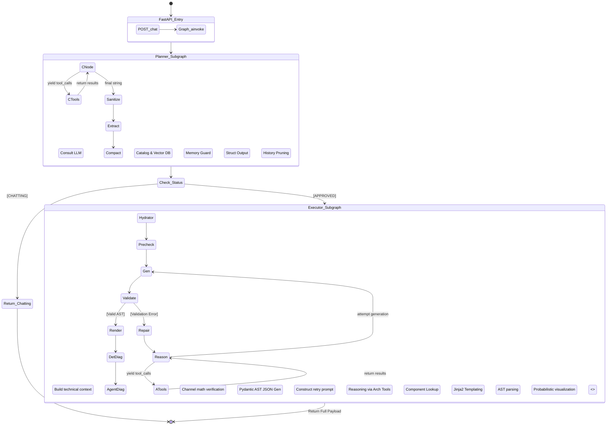
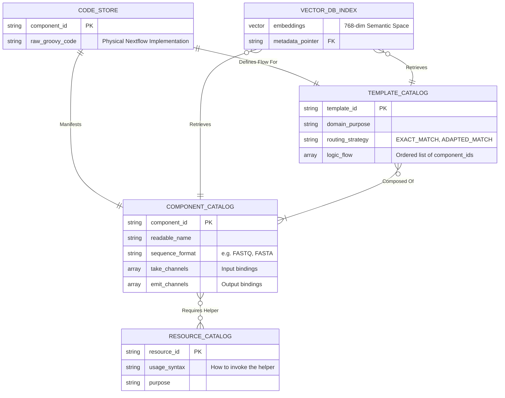

# Nextflow AI Agent API (izs-llm) - Domain-Agnostic Architectural Specification

> [!CAUTION]
> **System Scope:** This is the master documentation for the `izs-llm` framework. It is a **domain-agnostic** hybrid system integrating **FastAPI**, **LangGraph**, **Pydantic Guardrails**, **Advanced LLMs**, and **Pluggable Vector Semantics (ChromaDB / FAISS)**. Configured by default via plugins, the core engine itself is a pure Nextflow DSL2 pipeline architect capable of serving any domain.
> 
> *Warning:* The logic contained within is strictly deterministic where necessary (syntax generation) and highly probabilistic where allowed (planning). Proceed with extreme caution when modifying core state managers.

---

## 1. System Master Ontology & Top-Level Architecture

The izs-llm ecosystem is fundamentally a two-stage autonomous agent composed of a **Planner Subgraph** (the Consultant) and an **Execution Subgraph** (the Architect). It acts as a domain-agnostic abstraction layer between natural language intent and highly technical, hardware-bound execution environments (Nextflow DSL2).

### 1.1 The Tri-State Event Horizon (End-to-End Flow)

This sequence maps the absolute lifecycle of a single user request, detailing the micro-interactions between the web server, the vector storage engines, and the LLM execution graphs.

```mermaid
sequenceDiagram
    autonumber
    actor User as User (e.g., Domain Expert)
    participant Uvicorn as API Gateway (Uvicorn/FastAPI)
    participant DataLoader as Core Hydrator (core/loader.py)
    participant State as LangGraph InMemoryStore
    participant FAISS as Semantic Index (Vector DB)
    participant Agent as LangGraph Orchestrator (app_graph)
    
    %% Boot Phase
    rect rgb(20, 20, 40)
    Note right of Uvicorn: [LIFESPAN BOOT] Application Startup Phase
    Uvicorn->>DataLoader: lifespan(): trigger data_loader.load_all()
    DataLoader->>FAISS: Hydrate embeddings into Vector DB Client
    DataLoader->>State: Cache JSON catalogs (code_db, comp_db, tmpl_db)
    State-->>Uvicorn: Subsystems Online & Ready
    end

    %% Request Phase
    rect rgb(20, 40, 20)
    Note right of Uvicorn: [RUNTIME] Request & Semantic Routing
    User->>Uvicorn: POST /chat {session_id, message, generate_diagrams}
    Uvicorn->>Agent: app_graph.ainvoke(state, config.thread_id)
    
    %% Graph Phase - Planner
    Note over Agent: PHASE 1: Consultant Subgraph (Planning)
    Agent->>FAISS: query: Hybrid semantic search on user_message
    FAISS-->>Agent: return: top-K context blocks & template blueprints
    Agent->>Agent: LLM: Generate draft_plan & status
    
    alt Status == CHATTING
        Agent-->>Uvicorn: return ChatResponse {reply: "Needs more info"}
        Uvicorn-->>User: JSON Response
    else Status == APPROVED
        %% Graph Phase - Executor
        Note over Agent: PHASE 2: Execution Subgraph (Generation)
        Agent->>Agent: hydrator_node: Assemble technical context
        Agent->>Agent: architect_generate_node: Enforce Pydantic constraints
        Agent->>Agent: deterministic_diagram_node: AST -> Mermaid
        Agent->>Agent: renderer_node: AST -> Jinja2 -> DSL2
        Agent-->>Uvicorn: return ChatResponse {code, AST, diagrams}
        Uvicorn-->>User: Final Nextflow Pipeline Payload
    end
    end
```



---

## 2. The Agentic State Machine: Subgraph Mechanics

The core intelligence of izs-llm is routed through a LangGraph state machine. This is not a linear chain; it is a cyclic, self-repairing graph capable of tool usage, fallback reasoning, and semantic auto-correction.

### 2.1 The Master Graph Routing Matrix



---

## 3. Epistemic Architecture (Knowledge Engineering)

The AI engine is **completely domain and tool agnostic**. While configured via plugins, the core python framework knows nothing inherently about specific domain software. It is entirely bounded by the data catalogs in the active plugin's `data/` directory. This prevents hallucinated parameters or fabricated algorithms, allowing developers to plug in *any* command-line tool dynamically.

### 3.1 Entity Relationship Diagram of the Hive Mind



---

## 4. System Agnosticism & Modularity

The izs-llm architecture is engineered with extreme modularity, isolating the cognitive engine from domain-specific data and underlying LLM providers. 

### 4.1 LLM Provider Agnosticism
The application is entirely agnostic to the underlying AI model. 
- **Code Mapping:** Managed centrally via `core/services/llm.py`. The `get_llm()` factory pattern uses LangChain to dynamically bind standard API interfaces (OpenAI, Anthropic, Google, Local) based on the `LLM_PROVIDER` environment variable. 
- **Developer Impact:** You can swap reasoning engines by altering `.env` without changing a single line of logic inside the LangGraph nodes.

### 4.2 Domain Data Modularity (The Plugin System)
The agent possesses *no inherent knowledge* of specific scientific disciplines, domain logic, or specific Nextflow parameters. It is a pure logic engine.
- **Code Mapping:** Managed by `core/plugin_loader.py` and hydrated by `core/loader.py`. The active plugin (defined via `NF_AGENT_PLUGIN`) dictates the paths to component catalogs, prompt overlays, and vector indices (ChromaDB / FAISS). 
- **Developer Impact:** To adapt the agent for a completely different domain (e.g., computational chemistry, financial data processing, or MLOps), you only need to swap the active plugin directory. No Python code edits in `core/` are required.

### 4.3 Execution Graph Modularity
The "thought process" is not a massive monolithic prompt, but a highly isolated state machine.
- **Code Mapping:** Defined in `core/services/graph.py` and populated by `core/services/agents.py`.
- **Developer Impact:** The Consultant (Planner) and Architect (Executor) run in separate, isolated loops. This allows developers to easily inject deterministic Python validations (like `architect_precheck_node`) directly between the AI's planning phase and its generation phase.

---

## 5. Architectural Novelties (Scientific Publication Highlights)

The system was heavily overhauled to address the common failures of generic multi-agent architectures (e.g., "Small-LLM reasoning collapse", "Context window exhaustion", and endless tool loops). The following novel features represent the core technical contributions of the framework:

### 5.1 Lossless Tool-Trajectory Compaction
- **The Problem:** ReAct-style LLMs rapidly exhaust their context window when repeatedly querying Vector Databases, leading to "attention collapse" where they forget the user's original goal.
- **The Solution:** The `compact_memory_node` implements a surgical memory pruning algorithm. It extracts the concrete semantic facts from a tool's output, caches them in a structured `tool_memory` buffer, and completely deletes the raw tool call tokens from the chat history. The LLM retains the "knowledge" without the token bloat.

### 5.2 Deterministic Approval Short-Circuiting
- **The Problem:** LLMs struggle to decisively end planning loops, often hallucinating final tool calls just to say "I'm done."
- **The Solution:** The `consultant_node` bypasses the LLM for terminal routing. It uses an internal `_detect_approval` heuristic alongside structured output (`strict=True`) to forcibly sever the planning loop and route directly to the Execution Subgraph the moment human intent is satisfied.

### 5.3 Pydantic AST Enforcement
- **The Problem:** LLMs cannot reliably write valid Nextflow DSL2, especially concerning channel math and variable state tracking.
- **The Solution:** The `architect_generate_node` does not write code. It writes a strict Abstract Syntax Tree (AST) as a JSON object. This JSON is intercepted by deep Pydantic validators (`core/models/ast_structure.py`) that perform deterministic channel verification before passing it to the Jinja2 rendering engine.

### 5.4 Pairwise Glicko-2 Evaluation (Topo@k)
- **The Problem:** Traditional Pass@k metrics fail for multi-agent reasoning, and Likert-scale LLM Judges suffer from high variance.
- **The Solution:** The test harness (`tests/`) implements an advanced Pairwise A/B comparison with position-bias control and Chain-of-Thought reasoning. Models are evaluated using Glicko-2 ratings to mathematically prove architectural improvements.

---

## 6. Multi-Modal Diagram Generation Matrix

The system provides two distinct ways of perceiving the generated pipeline, addressing both engineering precision and human readability.

```mermaid
flowchart LR
    subgraph Data Sources
        AST[Strict AST JSON Object]
        Code[Raw Nextflow DSL2 Code]
    end
    
    subgraph Transformation Engines
        Engine1[Deterministic Engine\n(Python/AST parser)]
        Engine2[Probabilistic Engine\n(LLM)]
    end
    
    subgraph Outputs
        Out1{{Mermaid.js Flowchart}}:::deterministic
        Out2{{Mermaid.js Flowchart}}:::probabilistic
    end
    
    AST --> Engine1
    Engine1 -->|render_mermaid_from_ast| Out1
    
    Code --> Engine2
    Engine2 -->|diagram_node| Out2
    
    classDef deterministic fill:#1e3d59,stroke:#fff,stroke-width:2px,color:#fff
    classDef probabilistic fill:#ff6e40,stroke:#fff,stroke-width:2px,color:#fff
```

### The Dichotomy of Visualization
1. **Deterministic Diagram**: Created directly from the validated Abstract Syntax Tree. It is mathematically exact, rendering every node and edge identically to how the Jinja2 template renders the code. It is immune to hallucination.
2. **Agentic Diagram**: The LLM reads the final compiled code and attempts to draw it. This often summarizes complex logic into more human-readable "macro" steps, but is subject to probabilistic interpretation.

---

## 7. Repository Matrix & Master Index

| Directory / File | Core Responsibility | Engineering Designation |
| :--- | :--- | :--- |
| `main.py` | API Entrypoint | Instantiates Uvicorn ASGI server and triggers Lifespan hooks. |
| `core/` | **[ACTIVE] System Brain** | The modernized logic layer. Contains all graph nodes, tools, and strict validation schemas. |
| `core/api.py` | HTTP Routing | Exposes `/chat` and `/health`, maps Pydantic request models to LangGraph inputs. |
| `core/loader.py` | Data Hydration | Singleton manager for reading `.jsonl` and `.json` catalogs into memory matrices. |
| `core/models/` | Immune System | Pydantic classes defending against LLM syntax hallucinations. The ultimate source of truth. |
| `core/services/`| Cognitive Engines | The actual LangGraph nodes (`graph.py`, `agents.py`, `tools.py`). |
| `core/utils/` | Code Synthesizers | Pure algorithms (Jinja2) for rewriting abstract states into physical text. |
| `data/` | Semantic Memory Base | The physical `.nf` snippets, RAG indexes, and catalog JSONs. |
| `tests/` | QA & Benchmarking | Exhaustive test suite simulating hundreds of domain-specific use cases and failure scenarios. |
| `_app_legacy/` | **[DEPRECATED] Vault**| Old application structures preserved for historical context. **DO NOT USE.** |
| `Dockerfile` | Container Architecture| Defines the multi-stage build for scalable, stateless API deployments. |

> [!TIP]
> **Developer Navigation Protocol**:
> If you are adding a new domain tool: Update `data/catalog/` and `data/code_store_hollow.jsonl`.
> If the LLM is making syntax mistakes: Update `core/models/ast_structure.py`.
> If you are changing the pipeline building steps: Update `core/services/graph.py` and `agents.py`.

---

## 8. Development & Deployment Procedures

### 8.1 Local Iteration
```bash
# 1. Establish virtual environment
python -m venv venv && source venv/bin/activate
pip install -r requirements.txt

# 2. Inject Secrets
export OPENAI_API_KEY="your_key"
export JUDGE_BASE_URL="optional_for_testing"

# 3. Ignite Core
uvicorn main:app --reload --port 8000
```

### 8.2 Docker Orchestration
```bash
# Build the secure, slim runtime image
docker build -t izs-llm:latest .

# Deploy via Docker Compose (includes Caddy Reverse Proxy for edge routing)
docker-compose up -d
```

### 8.3 Graph Introspection (LangGraph Studio)
The repository includes a `langgraph.json` configuration file. You can attach LangGraph Studio directly to this repository to visually step through the `app_graph` execution matrix, inspect message histories, and rewind failed tool calls in real time.
