# IZS-LLM Validation Report

**Date**: 2026-04-03 11:46
**API**: http://localhost:8080
**Framework**: `/home/IZSNT/a.deruvo/cohesive-ngsmanager-cli/cohesive-ngsmanager`
**Prompts tested**: 22

## Summary

| Metric | Result |
|--------|--------|
| Positive tests | 16 |
| Nextflow valid | 15/16 |
| Mermaid valid | 16/16 |
| API errors | 0/16 |
| Negative tests (rejection) | 6/6 |

- **Simple**: 5/5
- **Medium**: 4/5
- **Complex**: 6/6
- **Negative**: 6/6

---

## [01] I want to trim my Illumina paired-end reads using fastp
**Level**: Simple | **Result**: pass

**Nextflow**: Runs
**Mermaid**: Valid

<details><summary>Nextflow Code</summary>

```nextflow
nextflow.enable.dsl=2

// --- IMPORTS ---

include { getSingleInput } from '../functions/parameters.nf'

include { step_1PP_trimming__fastp } from '../steps/step_1PP_trimming__fastp'

// --- GLOBALS ---

// --- INLINE PROCESSES ---

// --- SUB WORKFLOWS ---

// --- ENTRYPOINT ---
workflow {
    trimmed = step_1PP_trimming__fastp(getSingleInput()).trimmed
}
```
</details>

<details><summary>Mermaid Diagram</summary>

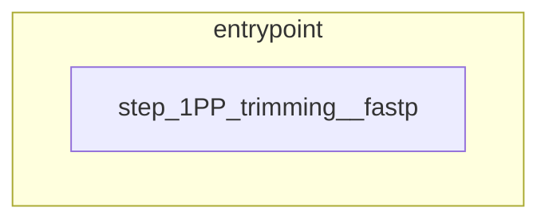
</details>

---

## [02] I have trimmed reads and want to do de novo assembly with SPAdes
**Level**: Simple | **Result**: pass

**Nextflow**: Structure OK
**Mermaid**: Valid

<details><summary>Nextflow Code</summary>

```nextflow
nextflow.enable.dsl=2

// --- IMPORTS ---

include { extractKey } from '../functions/common.nf'

include { getHost; getSingleInput } from '../functions/parameters.nf'

include { step_1PP_hostdepl__bowtie } from '../steps/step_1PP_hostdepl__bowtie'

include { step_2AS_denovo__spades } from '../steps/step_2AS_denovo__spades'

// --- GLOBALS ---

// --- INLINE PROCESSES ---

// --- SUB WORKFLOWS ---

workflow module_denovo {
    
    take:
        
        trimmedReads
        
        host
        
    
    main:
        trimmedReads.cross(host) { extractKey(it) }
            .map { [ it[0][0], it[0][1], it[1][1] ] }
            .branch {
                with_host: it[1][1]
                without_host: true
            }
            .set { branchedTrimmed }

        depleted = step_1PP_hostdepl__bowtie(branchedTrimmed.with_host)

        branchedTrimmed.without_host
            .mix(depleted)
            .map { it[0,1] }
            .set { denovoInput }

        assembled = step_2AS_denovo__spades(denovoInput)
    
    emit:
        
        assembled
        
        depleted
        
    
}

// --- ENTRYPOINT ---
workflow {
    module_denovo(getSingleInput(), getHost())
}
```
</details>

<details><summary>Mermaid Diagram</summary>


</details>

---

## [03] I want to check the quality of my reads with FastQC
**Level**: Simple | **Result**: pass

**Nextflow**: Runs
**Mermaid**: Valid

<details><summary>Nextflow Code</summary>

```nextflow
nextflow.enable.dsl=2

// --- IMPORTS ---

include { getSingleInput } from '../functions/parameters.nf'

include { module_qc_fastqc } from '../modules/module_qc_fastqc'

// --- GLOBALS ---

// --- INLINE PROCESSES ---

// --- SUB WORKFLOWS ---

// --- ENTRYPOINT ---
workflow {
    module_qc_fastqc(getSingleInput())
}
```
</details>

<details><summary>Mermaid Diagram</summary>

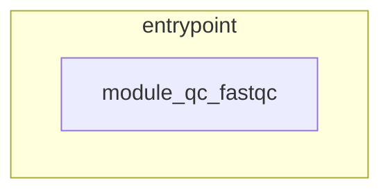
</details>

---

## [04] I want to assemble nanopore long reads with Flye
**Level**: Simple | **Result**: pass

**Nextflow**: Runs
**Mermaid**: Valid

<details><summary>Nextflow Code</summary>

```nextflow
nextflow.enable.dsl=2

// --- IMPORTS ---

include { getSingleInput } from '../functions/parameters.nf'

include { step_2AS_denovo__flye } from '../steps/step_2AS_denovo__flye'

// --- GLOBALS ---

// --- INLINE PROCESSES ---

// --- SUB WORKFLOWS ---

// --- ENTRYPOINT ---
workflow {
    flye_out = step_2AS_denovo__flye(getSingleInput())
    flye_out.assembly
}
```
</details>

<details><summary>Mermaid Diagram</summary>

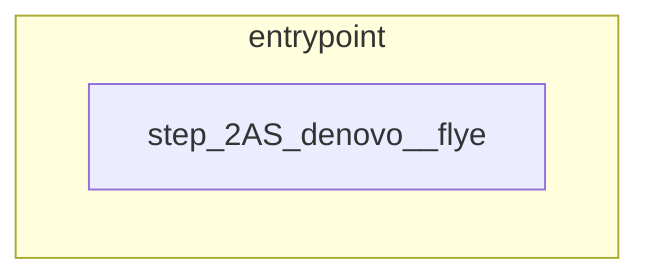
</details>

---

## [05] I want to trim my nanopore reads with Chopper
**Level**: Simple | **Result**: pass

**Nextflow**: Runs
**Mermaid**: Valid

<details><summary>Nextflow Code</summary>

```nextflow
nextflow.enable.dsl=2

// --- IMPORTS ---

include { getSingleInput } from '../functions/parameters.nf'

include { step_1PP_trimming__chopper } from '../steps/step_1PP_trimming__chopper'

// --- GLOBALS ---

// --- INLINE PROCESSES ---

// --- SUB WORKFLOWS ---

// --- ENTRYPOINT ---
workflow {
    trimmed = step_1PP_trimming__chopper(getSingleInput()).trimmed
}
```
</details>

<details><summary>Mermaid Diagram</summary>

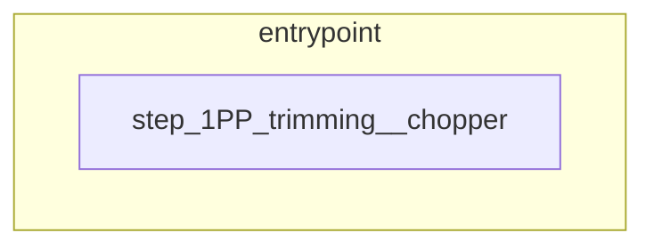
</details>

---

## [06] I have SARS-CoV-2 samples and want to do mapping and lineage assignment
**Level**: Medium | **Result**: pass

**Nextflow**: Runs
**Mermaid**: Valid

<details><summary>Nextflow Code</summary>

```nextflow
nextflow.enable.dsl=2

// --- IMPORTS ---

include { step_4TY_lineage__pangolin } from '../steps/step_4TY_lineage__pangolin'

include { getSingleInput } from '../functions/parameters.nf'

include { step_2AS_mapping__ivar } from '../steps/step_2AS_mapping__ivar'

// --- GLOBALS ---

def referenceCode = 'NC_045512.2'

def referencePath = "${params.assets_dir}/module_covid_emergency/NC_045512.fasta"

def referenceRiscd = '220308-020220308005121273-2AS_import-external'

// --- INLINE PROCESSES ---

// --- SUB WORKFLOWS ---

workflow module_covid_emergency {
    
    take:
        
        trimmed
        
    
    main:
        trimmed.multiMap {
            trimmed: it
            reference: [ referenceRiscd, referenceCode, file(referencePath) ]
        }.set { trAndRef }

        consensus = step_2AS_mapping__ivar(trAndRef.trimmed, trAndRef.reference).consensus
        step_4TY_lineage__pangolin(consensus)
    
}

// --- ENTRYPOINT ---
workflow {
    module_covid_emergency(getSingleInput())
}
```
</details>

<details><summary>Mermaid Diagram</summary>

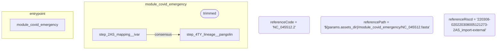
</details>

---

## [07] I want to do de novo assembly but first remove human host reads
**Level**: Medium | **Result**: pass

**Nextflow**: Structure OK
**Mermaid**: Valid

<details><summary>Nextflow Code</summary>

```nextflow
nextflow.enable.dsl=2

// --- IMPORTS ---

include { extractKey } from '../functions/common.nf'

include { getHost; getSingleInput } from '../functions/parameters.nf'

include { step_1PP_hostdepl__bowtie } from '../steps/step_1PP_hostdepl__bowtie'

include { step_2AS_denovo__spades } from '../steps/step_2AS_denovo__spades'

// --- GLOBALS ---

// --- INLINE PROCESSES ---

// --- SUB WORKFLOWS ---

workflow module_denovo {
    
    take:
        
        trimmedReads
        
        host
        
    
    main:
        trimmedReads.cross(host) { extractKey(it) }
            .map { [ it[0][0], it[0][1], it[1][1] ] } //riscd, reads, host
            .branch {
                with_host: it[1][1]
                without_host: true
            }
            .set { branchedTrimmed }

            depleted = step_1PP_hostdepl__bowtie(branchedTrimmed.with_host)

            branchedTrimmed.without_host
                .mix(depleted)
                .map { it[0,1] }
                .set{ denovoInput }
            assembled = step_2AS_denovo__spades(denovoInput)
    
    emit:
        
        assembled
        
        depleted
        
    
}

// --- ENTRYPOINT ---
workflow {
    module_denovo(getSingleInput(), getHost())
}
```
</details>

<details><summary>Mermaid Diagram</summary>

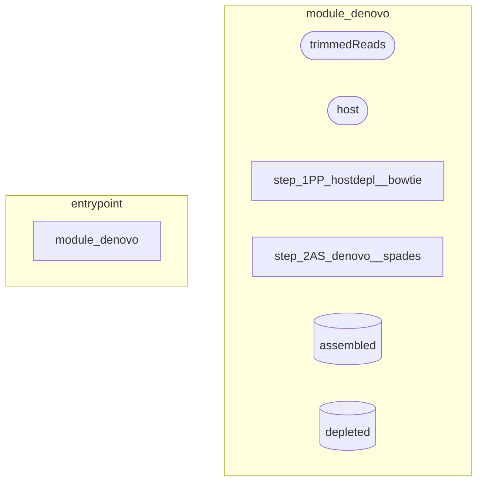
</details>

---

## [08] I have West Nile Virus samples and want to determine lineage and do mapping
**Level**: Medium | **Result**: pass

**Nextflow**: Structure OK
**Mermaid**: Valid

<details><summary>Nextflow Code</summary>

```nextflow
nextflow.enable.dsl=2

// --- IMPORTS ---

include { step_2AS_mapping__minimap2 } from '../steps/step_2AS_mapping__minimap2'

include { getReference; getSingleInput } from '../functions/parameters.nf'

include { step_4TY_lineage__westnile } from '../steps/step_4TY_lineage__westnile'

// --- GLOBALS ---

// --- INLINE PROCESSES ---

// --- SUB WORKFLOWS ---

// --- ENTRYPOINT ---
workflow {
    step_4TY_lineage__westnile(getSingleInput())
    step_2AS_mapping__minimap2(getSingleInput(), getReference('fa'))
}
```
</details>

<details><summary>Mermaid Diagram</summary>

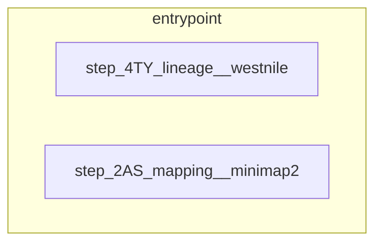
</details>

---

## [09] I want to map reads to a reference using Bowtie2
**Level**: Medium | **Result**: pass

**Nextflow**: Structure OK
**Mermaid**: Valid

<details><summary>Nextflow Code</summary>

```nextflow
nextflow.enable.dsl=2

// --- IMPORTS ---

include { getReference; getSingleInput } from '../functions/parameters.nf'

include { step_2AS_mapping__bowtie } from '../steps/step_2AS_mapping__bowtie'

include { extractKey } from '../functions/common.nf'

// --- GLOBALS ---

// --- INLINE PROCESSES ---

// --- SUB WORKFLOWS ---

// --- ENTRYPOINT ---
workflow {
    getSingleInput().cross(getReference('fa')) { extractKey(it) }.multiMap { reads: it[0]; refs: it[1][1..3] }.set { input }
    step_2AS_mapping__bowtie(input.reads, input.refs)
}
```
</details>

<details><summary>Mermaid Diagram</summary>

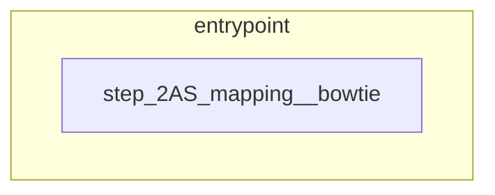
</details>

---

## [10] I want to do species identification with KmerFinder on my assemblies
**Level**: Medium | **Result**: WARN

**Nextflow**: FAILED
- `ERROR ~ unexpected acc value: 0SQ_rawreads, expected: one of [2AS_denovo, 2AS_import, 2AS_mapping]`
**Mermaid**: Valid

<details><summary>Nextflow Code</summary>

```nextflow
nextflow.enable.dsl=2

// --- IMPORTS ---

include { getAssembly } from '../functions/parameters.nf'

include { step_3TX_species__kmerfinder } from '../steps/step_3TX_species__kmerfinder'

// --- GLOBALS ---

// --- INLINE PROCESSES ---

// --- SUB WORKFLOWS ---

// --- ENTRYPOINT ---
workflow {
    kmerfinder_out = step_3TX_species__kmerfinder(getAssembly())
    assigned_species = kmerfinder_out.assigned_species
}
```
</details>

<details><summary>Mermaid Diagram</summary>

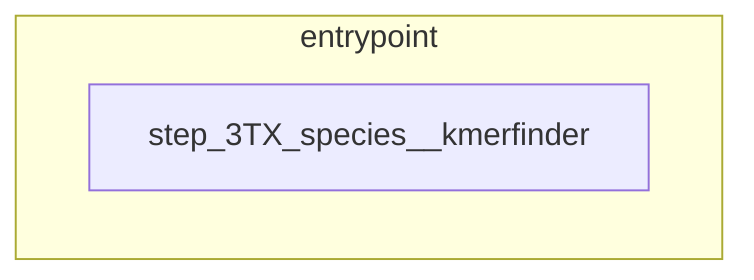
</details>

---

## [11] I have bacterial Illumina isolates. I want to identify species, do MLST, and find resistance genes
**Level**: Complex | **Result**: pass

**Nextflow**: Runs
**Mermaid**: Valid

<details><summary>Nextflow Code</summary>

```nextflow
nextflow.enable.dsl=2

// --- IMPORTS ---

include { getSingleInput } from '../functions/parameters.nf'

include { step_4AN_genes__prokka } from '../steps/step_4AN_genes__prokka'

include { step_4TY_MLST__mlst } from '../steps/step_4TY_MLST__mlst'

include { step_4AN_AMR__abricate } from '../steps/step_4AN_AMR__abricate'

include { step_4AN_AMR__staramr } from '../steps/step_4AN_AMR__staramr'

include { getEmpty } from '../functions/common.nf'

include { step_3TX_species__kmerfinder } from '../steps/step_3TX_species__kmerfinder'

// --- GLOBALS ---

// --- INLINE PROCESSES ---

// --- SUB WORKFLOWS ---

// --- ENTRYPOINT ---
workflow {
    kmerfinder_out = step_3TX_species__kmerfinder(getSingleInput())
    step_4TY_MLST__mlst(kmerfinder_out.assigned_species)
    step_4AN_AMR__abricate(kmerfinder_out.assigned_species)
    step_4AN_AMR__staramr(kmerfinder_out.assigned_species, kmerfinder_out.assigned_species.map { it[1] })
    step_4AN_genes__prokka(kmerfinder_out.assigned_species.map { [ it[0], it[2], 'Bacteria', '-', '-', getEmpty() ] })
}
```
</details>

<details><summary>Mermaid Diagram</summary>

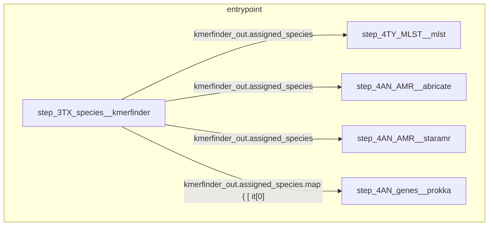
</details>

---

## [12] I want to reconstruct a viral genome: reference mapping, consensus and Prokka annotation
**Level**: Complex | **Result**: pass

**Nextflow**: Structure OK
**Mermaid**: Valid

<details><summary>Nextflow Code</summary>

```nextflow
nextflow.enable.dsl=2

// --- IMPORTS ---

include { extractKey } from '../functions/common.nf'

include { getReference; getReferenceOptional; getSingleInput } from '../functions/parameters.nf'

include { step_2AS_mapping__bowtie } from '../steps/step_2AS_mapping__bowtie'

include { step_4AN_genes__prokka } from '../steps/step_4AN_genes__prokka'

include { step_2AS_mapping__ivar } from '../steps/step_2AS_mapping__ivar'

// --- GLOBALS ---

def PROKKA_KINGDOM = 'Viruses'

// --- INLINE PROCESSES ---

// --- SUB WORKFLOWS ---

workflow module_draft_genome {
    
    take:
        
        reads
        
        reference
        
        referenceGB
        
    
    main:
        reads.cross(reference) { extractKey(it) }.multiMap { 
                    reads: it[0] // riscd, reads
                    refs:  it[1][1..3] // riscd, code, path
                }.set { readsAndReferences }

                step_2AS_mapping__bowtie(readsAndReferences.reads, readsAndReferences.refs)

                consensus = step_2AS_mapping__ivar(readsAndReferences.reads, readsAndReferences.refs).consensus

                consensus.cross(referenceGB) { extractKey(it) }.map { 
                    [ it[0][0], it[0][1], PROKKA_KINGDOM, it[1][1], it[1][2], it[1][3] ] // riscd assembly kingdom riscd_ref refid refpath]
                }.set { consensusKingdomReference }

                step_4AN_genes__prokka(consensusKingdomReference)
    
}

// --- ENTRYPOINT ---
workflow {
    module_draft_genome(getSingleInput(), getReference('fa'), getReferenceOptional('gb'))
}
```
</details>

<details><summary>Mermaid Diagram</summary>

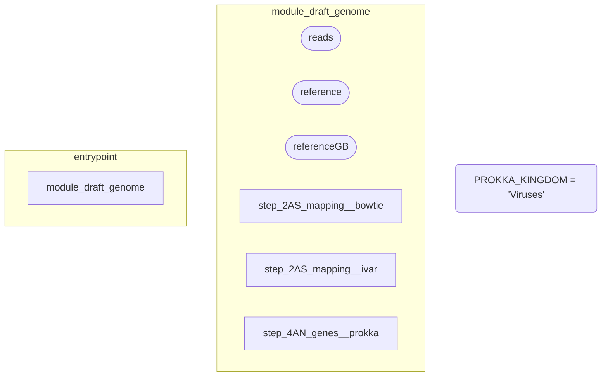
</details>

---

## [13] I have a mixed clinical sample. I want to extract only reads that map to a specific reference and then assemble only those
**Level**: Complex | **Result**: pass

**Nextflow**: Structure OK
**Mermaid**: Valid

<details><summary>Nextflow Code</summary>

```nextflow
nextflow.enable.dsl=2

// --- IMPORTS ---

include { extractKey } from '../functions/common.nf'

include { getReference; getSingleInput } from '../functions/parameters.nf'

include { step_1PP_filtering__bowtie } from '../steps/step_1PP_filtering__bowtie'

include { step_2AS_denovo__spades } from '../steps/step_2AS_denovo__spades'

// --- GLOBALS ---

// --- INLINE PROCESSES ---

// --- SUB WORKFLOWS ---

// --- ENTRYPOINT ---
workflow {
    rawReads = getSingleInput()
    reference = getReference('fa')

    rawReads.cross(reference) { extractKey(it) }.multiMap {
        reads: it[0]
        refs: it[1][1..3]
    }.set { input }

    filteredReads = step_1PP_filtering__bowtie(input.reads, input.refs)

    assembled = step_2AS_denovo__spades(filteredReads)
}
```
</details>

<details><summary>Mermaid Diagram</summary>

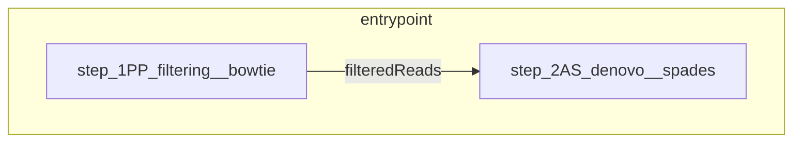
</details>

---

## [14] I want to trim Illumina reads with fastp, do de novo assembly with SPAdes, and then run Abricate for AMR detection
**Level**: Complex | **Result**: pass

**Nextflow**: Runs
**Mermaid**: Valid

<details><summary>Nextflow Code</summary>

```nextflow
nextflow.enable.dsl=2

// --- IMPORTS ---

include { getSingleInput } from '../functions/parameters.nf'

include { step_1PP_trimming__fastp } from '../steps/step_1PP_trimming__fastp'

include { step_2AS_denovo__spades } from '../steps/step_2AS_denovo__spades'

include { step_4AN_AMR__abricate } from '../steps/step_4AN_AMR__abricate'

// --- GLOBALS ---

// --- INLINE PROCESSES ---

// --- SUB WORKFLOWS ---

// --- ENTRYPOINT ---
workflow {
    trimmed = step_1PP_trimming__fastp(getSingleInput()).trimmed
    assembled = step_2AS_denovo__spades(trimmed).assembled
    step_4AN_AMR__abricate(assembled)
}
```
</details>

<details><summary>Mermaid Diagram</summary>

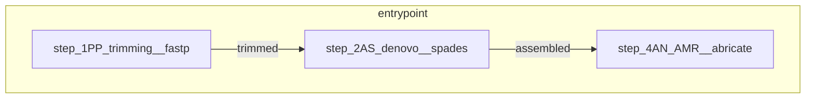
</details>

---

## [15] I have bacterial isolates. Trim with fastp, assemble with Shovill, identify species with KmerFinder, and run MLST
**Level**: Complex | **Result**: pass

**Nextflow**: Runs
**Mermaid**: Valid

<details><summary>Nextflow Code</summary>

```nextflow
nextflow.enable.dsl=2

// --- IMPORTS ---

include { getSingleInput } from '../functions/parameters.nf'

include { step_1PP_trimming__fastp } from '../steps/step_1PP_trimming__fastp'

include { step_2AS_denovo__shovill } from '../steps/step_2AS_denovo__shovill'

include { step_4TY_MLST__mlst } from '../steps/step_4TY_MLST__mlst'

include { step_3TX_species__kmerfinder } from '../steps/step_3TX_species__kmerfinder'

// --- GLOBALS ---

// --- INLINE PROCESSES ---

// --- SUB WORKFLOWS ---

// --- ENTRYPOINT ---
workflow {
    trimmed = step_1PP_trimming__fastp(getSingleInput()).trimmed
    assembly = step_2AS_denovo__shovill(trimmed).assembly
    step_3TX_species__kmerfinder(assembly)
    step_4TY_MLST__mlst(assembly)
}
```
</details>

<details><summary>Mermaid Diagram</summary>

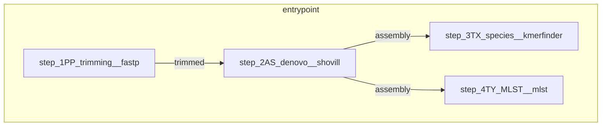
</details>

---

## [16] I want to do host depletion with Bowtie, then assemble the depleted reads with SPAdes, and annotate with Prokka
**Level**: Complex | **Result**: pass

**Nextflow**: Structure OK
**Mermaid**: Valid

<details><summary>Nextflow Code</summary>

```nextflow
nextflow.enable.dsl=2

// --- IMPORTS ---

include { extractKey; getEmpty } from '../functions/common.nf'

include { getHostUnkeyed; getSingleInput } from '../functions/parameters.nf'

include { step_1PP_hostdepl__bowtie } from '../steps/step_1PP_hostdepl__bowtie'

include { step_4AN_genes__prokka } from '../steps/step_4AN_genes__prokka'

include { step_2AS_denovo__spades } from '../steps/step_2AS_denovo__spades'

// --- GLOBALS ---

// --- INLINE PROCESSES ---

// --- SUB WORKFLOWS ---

// --- ENTRYPOINT ---
workflow {
    raw_reads = getSingleInput()

    // Step 1: Host depletion using step_1PP_hostdepl__bowtie
    host_depleted = step_1PP_hostdepl__bowtie(raw_reads.cross(getHostUnkeyed()) { extractKey(it) }.map { [ it[0][0], it[0][1], it[1][1] ] })

    // Step 2: Assembly using step_2AS_denovo__spades
    assembly_out = step_2AS_denovo__spades(host_depleted.depleted)

    // Step 3: Annotation using step_4AN_genes__prokka
    step_4AN_genes__prokka(assembly_out.assembled.map { [ it[0], it[1], 'Bacteria', '-', '-', getEmpty() ] })
}
```
</details>

<details><summary>Mermaid Diagram</summary>

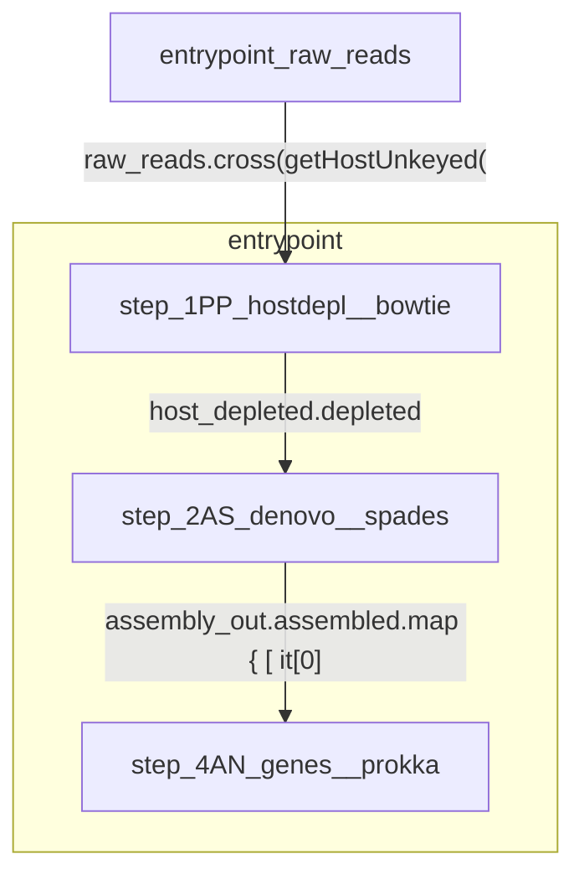
</details>

---

## [17] I want to do mapping with BWA
**Level**: Negative | **Result**: pass

**Expected**: Rejection
**Rejected**: Yes

> BWA is not available in this framework. For read mapping, I can offer: Bowtie2 (`step_2AS_mapping__bowtie`) for short reads, Minimap2 (`step_2AS_mapping__minimap2`) for long reads, or iVar (`step_2AS_mapping__ivar`) for viral consensus. Which would you prefer?

## [18] I want to assemble my nanopore long reads with Canu
**Level**: Negative | **Result**: pass

**Expected**: Rejection
**Rejected**: Yes

> Canu is not available in this framework. For nanopore long-read assembly, I can offer Flye (`step_2AS_denovo__flye`), which is optimized for long reads and produces high-quality assemblies. Would you like to proceed with Flye for your nanopore data?

## [19] I have Salmonella samples and want to determine lineage with Pangolin
**Level**: Negative | **Result**: pass

**Expected**: Rejection
**Rejected**: Yes

> Pangolin is specifically designed for SARS-CoV-2 lineage assignment and cannot be used for bacteria like Salmonella. For Salmonella typing, I can offer the following alternatives:

1. **MLST (Multi-Locus Sequence Typing)**: `step_4TY_MLST__mlst` for traditional sequence typing.
2. **cgMLST (Core Gen

## [20] I want to do de novo assembly with iVar
**Level**: Negative | **Result**: pass

**Expected**: Rejection
**Rejected**: Yes

> iVar is a reference-based mapping and consensus calling tool, not an assembler. For de novo assembly, I can offer tools like SPAdes (`step_2AS_denovo__spades`), Shovill (`step_2AS_denovo__shovill`), Unicycler (`step_2AS_denovo__unicycler`), or Flye (`step_2AS_denovo__flye`) for long reads. Which too

## [21] I want to run Trimgalore on my reads
**Level**: Negative | **Result**: pass

**Expected**: Rejection
**Rejected**: Yes

> Trimgalore is not available in this framework. For read trimming, I can offer: fastp (`step_1PP_trimming__fastp`), Trimmomatic (`step_1PP_trimming__trimmomatic`), or Chopper (`step_1PP_trimming__chopper`) for Nanopore reads. Which would you prefer?

## [22] I want to use GATK for variant calling
**Level**: Negative | **Result**: pass

**Expected**: Rejection
**Rejected**: Yes

> GATK is not available in this framework. For variant calling and consensus generation, I can offer: iVar (`step_2AS_mapping__ivar`), Bowtie2 (`step_2AS_mapping__bowtie`), or Minimap2 (`step_2AS_mapping__minimap2`). Which would you prefer?
