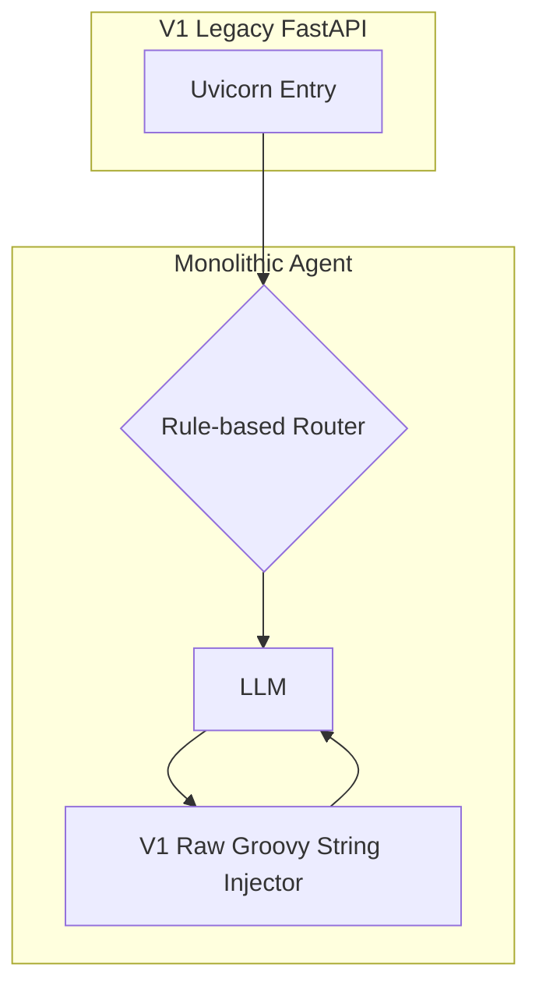

# `_app_legacy/` - [DEPRECATED] Historical Vault

> [!CAUTION]
> **THIS DIRECTORY IS DEPRECATED.** 
> All active development has moved to `core/`. This directory is preserved strictly as a historical archive to document the V1 architecture. **Do not import from, execute, or modify any files within this directory.**

## 1. Historical Architecture (V1)

The V1 architecture utilized a much tighter loop that lacked the robust deterministic Pydantic auto-healing present in the V2 (`core/`) architecture.

## 2. Why was this deprecated?

1. **String Injection Failures:** V1 attempted to allow the LLM to write raw Groovy Nextflow code. This resulted in catastrophic hallucination rates. V2 (`core/`) forces the LLM to write JSON ASTs, which are then deterministically rendered.
2. **Missing Auto-Healers:** V1 relied solely on LLM retry loops to fix errors. This was too expensive and slow.
3. **Monolithic State:** The V1 `GraphState` became too bloated, causing the LLMs to suffer from lost-in-the-middle context issues.

Please refer to `core/README.md` for the modern domain-agnostic system featuring Lossless Tool-Trajectory Compaction, Deterministic Approval Short-Circuiting, and Pydantic AST Enforcement.
