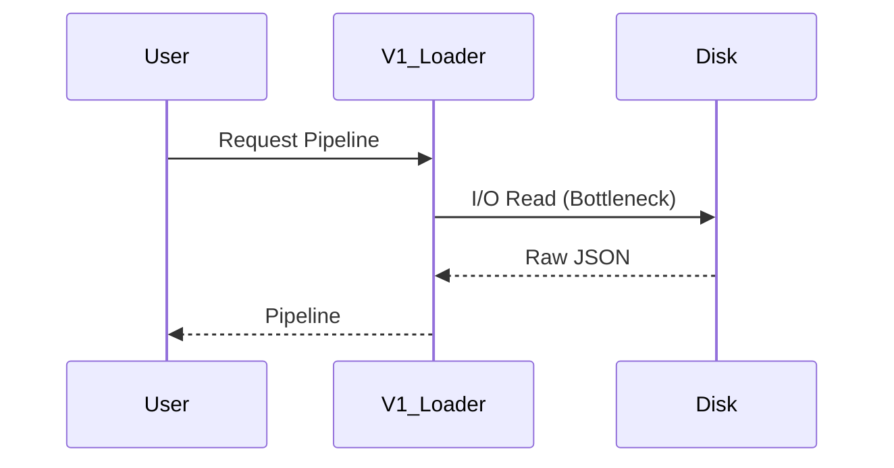

# `_app_legacy/core/` - [DEPRECATED]

> [!CAUTION]
> **THIS DIRECTORY IS DEPRECATED.** 
> This is a historical snapshot of the V1 core utilities. See `core/loader.py` and `core/config.py` in the root `core/` directory for the active domain-agnostic system.

## 1. Historical Context: V1 Data Loaders

The V1 data loaders attempted to stream catalogs dynamically from disk during execution, rather than pre-caching them in memory during the Uvicorn Lifespan event. 

This architecture was deprecated due to extreme latency under load. V2 utilizes `InMemoryStore` for zero-latency lookups.
