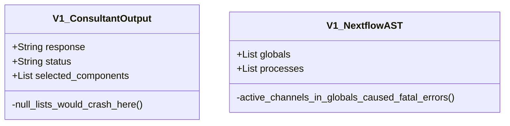

# `_app_legacy/models/` - [DEPRECATED]

> [!CAUTION]
> **THIS DIRECTORY IS DEPRECATED.** 
> These are the V1 Pydantic models. They lack the `@model_validator` auto-healing functions. **Use `core/models/` for active development featuring Pydantic AST Enforcement.**

## 1. Historical Context: V1 Schema Enforcement

The V1 models successfully forced structured output, but they did not have the capability to mutate and repair the data structures actively.

V2 introduced "The Silent Healer" pipelines that fix LLM mistakes deterministically.
