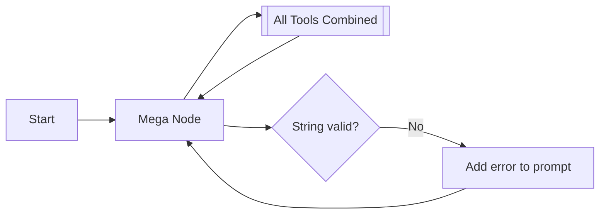

# `_app_legacy/services/` - [DEPRECATED]

> [!CAUTION]
> **THIS DIRECTORY IS DEPRECATED.** 
> This contains the V1 monolithic LangGraph architecture. For the active, bifurcated architecture featuring Lossless Tool-Trajectory Compaction and Deterministic Approval, see `core/services/`.

## 1. Historical Context: V1 Graph Operations

The V1 graph did not isolate planning from generation. It allowed the LLM to hallucinate tool parameters while trying to write code simultaneously.

This resulted in infinite loops and context exhaustion. V2 separates concerns into two distinct subgraphs.
