# `_app_legacy/utils/` - [DEPRECATED]

> [!CAUTION]
> **THIS DIRECTORY IS DEPRECATED.** 
> This is the V1 Jinja2 rendering engine. It has been replaced by the domain-agnostic `core/utils/rendering.py`.

## 1. Historical Context: V1 Rendering

The V1 rendering template was highly rigid and struggled with dynamic sub-workflow imports. 

```mermaid
gantt
    title V1 Rendering Inefficiencies
    dateFormat X
    axisFormat %s
    
    section V1 Engine
    Process JSON :a1, 0, 2
    Concat Strings Manually :a2, after a1, 3
    Regex Hacks for Whitespace :a3, after a2, 4
```

V2 relies completely on pure Jinja2 looping capabilities, removing fragile python string concatenations.
