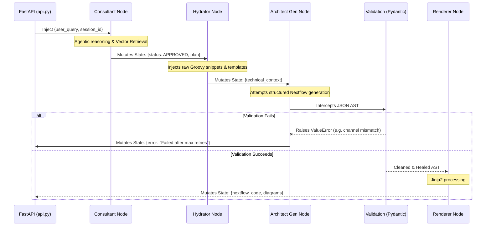

# `core/` Directory - API and Graph Internals

> [!IMPORTANT]
> This is the **Active Core** of the Domain-Agnostic Nextflow Agent. All references to `app/` in the codebase have been migrated here. This layer hosts the FastAPI server, orchestrates the LangGraph autonomous agents, and encapsulates the semantic data engines. It contains **zero domain-specific knowledge**; it is a pure structural graph engine designed to read generic plugins.

## 1. Subsystem Architecture

The `core` directory is responsible for turning incoming HTTP connections into heavily structured LangGraph operations. It achieves this by enforcing a strict decoupling of intent generation from syntax execution.

### 1.1 The Graph Execution Lifecycle

This sequence diagram illustrates the exact lifecycle of the `GraphState` object as it is mutated by the node network.

## 2. Directory Matrix

| Path | Purpose | Key Subsystems |
| :--- | :--- | :--- |
| `api.py` | Network Edge | Exposes `/chat` endpoint. Instantiates `ChatRequest` and `ChatResponse` models. |
| `loader.py` | Data Ingestion | The `DataLoader` singleton. Ingests catalogs and vector DB index at boot. |
| `config.py` | Configuration | Environment variable bindings (`NF_FRAMEWORK_DIR`, `MAX_TOOL_ITERATIONS`). |
| `catalog_registry.py` | Component Truth | Centralized registry for valid components, handling explicit void-tool configurations. |
| `plugin_loader.py` | Dynamic Rulesets | Ingests `plugin.yaml` to hot-swap domains, models, prompts, and catalogs. |
| `tool_registry.py` | Tool Exporter | Binds standard python functions to LangGraph `ToolNode` instances. |
| `adapters/` | Infrastructure | Interfaces for abstracting Vector DBs (Chroma/FAISS) and generic LLM Providers. |
| `models/` | Logic Enforcement | The schemas that implement **Pydantic AST Enforcement** to validate and auto-heal LangGraph output (`ast_structure.py`). |
| `nodes/` | Graph Execution | The discrete, runnable agent states containing the LLM invocation logic (`architect.py`, `consultant.py`, `hydrator.py`). |
| `services/` | Graph Orchestration | Contains the primary graph topologies (`graph.py`) and localized error-handling sub-loops (`repair.py`). |
| `utils/` | Algorithmic Translators | Jinja2 engines for translating data structures into DSL2 strings. |
| `prompts/` | System Personas | The raw markdown templates that define the agent instructions. |

## 3. High-Level Operations Manual

### 3.1 Network Edge Operations (`api.py`)
The `api.py` layer is a thin wrapper designed for maximum concurrency.
- **`lifespan(app)`**: Executes exactly once on server boot. Blocks the event loop until `data_loader.load_all()` has fully cached the 768-dimensional vector space and `.jsonl` catalogs into memory. This ensures zero disk I/O during conversation generation.
- **`chat_with_agent(request)`**: The primary controller. It translates a REST API request into a LangGraph state dictionary, calls `.ainvoke()`, and translates the mutated state back into a REST response. It handles the LangGraph `InMemoryStore` to persist the `thread_id` across multi-turn sessions.

### 3.2 State Management (`loader.py` & `config.py`)
- The system heavily relies on `InMemoryStore` provided by LangGraph to hold the `code_db` (physical `.nf` lines).
- Reverse indexes (like usage snippets mapping a component back to its parent templates) are generated dynamically at boot to save disk space and improve retrieval latency.
- Provider agnosticism is handled via `config.py`, allowing the system to hot-swap between Anthropic, OpenAI, or local Mistral models without modifying the graph topology.

## 4. The Cognitive Engine & Architectural Novelties

The cognitive logic of the system lives heavily across the `services/` and `nodes/` packages. The agentic execution is split into two massive subgraphs: the **Consultant Subgraph** (decides *what* to do) and the **Architect Subgraph** (decides *how* to write it). This decoupling is enforced by three major architectural novelties:

### 4.1 Lossless Tool-Trajectory Compaction
LLMs crash when their context window fills with raw tool logs. The `compact_memory` node surgically intercepts raw catalog lookup JSONs. It prunes the token bloat and distills the returned data into a highly dense semantic fact, completely erasing the massive API call history while preserving the knowledge. This allows the Consultant to explore the catalog indefinitely without ever hitting context exhaustion.

### 4.2 Deterministic Approval Short-Circuiting
To prevent the LLM from getting stuck in an infinite planning loop, the `ConsultantOutput` Pydantic model enforces a strict status enum: `["CHATTING", "APPROVED"]`. When the agent decides the user's intent is satisfied, it sets the status to `APPROVED`. This triggers a deterministic LangGraph conditional edge (`services/graph.py`) that forcibly severs the Consultant loop and routes the state dictionary straight into the Architect subgraph for execution.

### 4.3 Pydantic AST Enforcement & The "Silent Healer"
The Architect subgraph never writes raw Nextflow code. It generates a deeply nested JSON Abstract Syntax Tree (AST). 
- **The Silent Healer**: Defined in `models/ast_structure.py`, Pydantic `@model_validator` methods intercept trivial LLM hallucinations (like placing an active channel in a global block) and silently mutate the object back to health.
- **The Hard Refusal**: If the LLM hallucinates an impossible data flow, the Pydantic validator throws a strict `ValueError`. This triggers a localized retry-loop in the Architect subgraph (`repair.py`), feeding the precise Python stack trace back to the LLM to force self-correction before it can output code.

## 5. System Modularity & Domain Agnosticism

The most critical feature of the `core/` directory is its absolute **System Modularity**. 

The core Python logic contains absolutely no hardcoded domain definitions. Instead, the `api.py` execution edge relies entirely on dynamically injected payloads defined via `plugin.yaml`.

### 5.1 The Modularity Contract
When a REST request enters the system, the LangGraph topology does not know if it is building a genomics pipeline, a financial data processor, or an image rendering workflow. 
1. The **State Schema** accepts generic arrays of `tools`.
2. The **Agent Prompts** are strictly templated, loading their domain idioms and guardrails dynamically from external markdown files injected by the active plugin.
3. The **Validators** (`ast_structure.py`) do not check for specific tool names; they check that the requested tool exists in the active catalog and mathematically verify its `emit_channels` array.

By strictly adhering to this modularity contract, the core framework remains an indestructible, pure routing engine capable of powering any pipeline framework.
