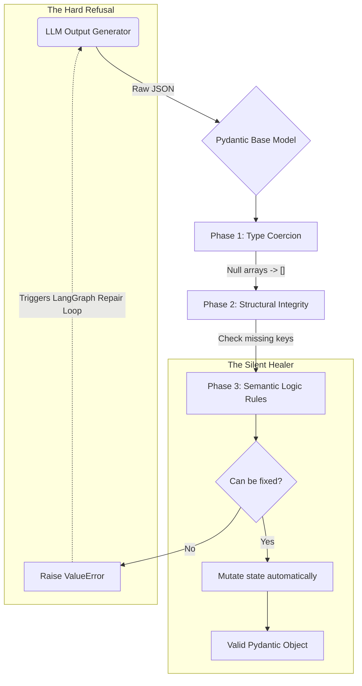
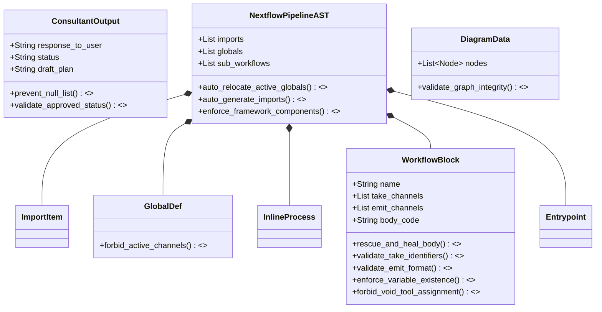

# `core/models/` - Pydantic Guardrails & Defensive Engineering

> [!CAUTION]
> **This is the system's immune response.** Large Language Models are highly prone to hallucinating parameters, variable names, and code syntax. This directory intercepts raw LLM outputs (JSON) and aggressively enforces logical, structural, and computational reality before execution. The framework uses the active plugin's catalog definitions to strictly bound the LLM to valid operations, making these guardrails completely domain-agnostic.

## 1. Pydantic AST Enforcement (The Validation Pipeline)

Rather than allowing the LLM to write raw strings of text, the `architect_generate_node` forces the LLM to populate a deep JSON structure representing the Abstract Syntax Tree (AST). As this JSON is converted into Python objects, the Pydantic models in this directory act as a multi-stage deterministic filter.

## 2. Comprehensive Class & Validation Matrix

This ER diagram demonstrates every validation hook and healing method applied to the Nextflow Abstract Syntax Tree (AST).

## 3. The Two Doctrines of Validation

The core philosophy of this directory is that the LLM is unpredictable, but the pipeline execution environment is extremely rigid. The validation layer applies two distinct strategies to bridge this gap.

### 3.1 Deterministic Auto-Healing (The "Silent Healer")
LLMs frequently make trivial syntax formatting mistakes that are easily identifiable. Rather than wasting 30 seconds and expensive API tokens on a LangGraph retry loop, Pydantic `@model_validator(mode='before')` and `@field_validator` methods silently mutate the object back to health:
- **`rescue_and_heal_body`**: If the LLM wraps code in `workflow { ... }` despite being instructed not to, the healer regex actively strips the wrapping braces out.
- **`auto_relocate_active_globals`**: If the LLM incorrectly places an active function call like `Channel.fromPath()` in the static global definitions block, the healer rips the code block out and safely pastes it into the main entrypoint body.
- **`auto_generate_imports`**: The LLM is instructed not to guess imports. Instead, Pydantic scans the AST body for used component IDs and automatically builds the correct module import paths based on the active plugin's JSON catalog.

### 3.2 Self-Correction Feedback Generation (The "Hard Refusal")
When the LLM makes a severe structural or logical syntax error that cannot be deterministically guessed, the validator throws a highly specific `ValueError`. This error is captured by the LangGraph executor and injected back into the LLM prompt, forcing it to try again with the exact failure details.
- **`enforce_variable_existence`**: The LLM cannot `.set` or `.mix()` a channel that was never declared upstream.
- **`forbid_void_tool_assignment`**: The LLM cannot capture the output of a Void tool (e.g. `res = terminal_qc(data)`). The validator checks the tool against the active domain catalog and throws a fatal error if it has zero emit channels.
- **`validate_emit_format`**: Ensures outputs adhere strictly to Nextflow DSL2 property assignments.

## 4. Diagram & UI Safety (`diagram_structure.py`)

Mermaid.js is notorious for crashing entire web UI renderers if a string contains an unescaped quote or a reserved keyword in its labels or node definitions. 
- The models in `diagram_structure.py` enforce strict alphanumeric requirements on node IDs.
- They aggressively sanitize and escape all display labels before the JSON payload is ever returned to the FastAPI edge.
- They verify Graph connectivity (ensuring no floating edges or orphaned nodes) to guarantee the frontend UI can render the visual workflow flawlessly.
