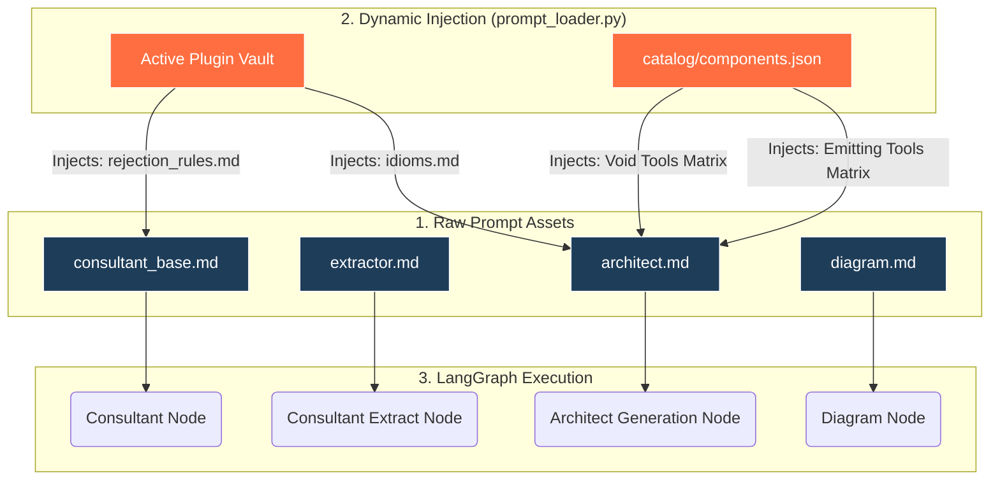

# `core/prompts/` - The Cognitive Architecture Base

> [!IMPORTANT]
> This directory acts as the core personality and cognitive logic foundation for the LangGraph agents. It contains the base markdown templates that dictate exactly how the LLMs reason, validate constraints, and structure their outputs.

## 1. The Dynamic Injection Pipeline

The prompts in this directory are not static strings. They serve as massive string-interpolation templates. At runtime, the `core/services/prompt_loader.py` engine loads these files and injects highly specific, real-time context from the active Plugin before passing them to the LLM.

## 2. Core Prompt Definitions

### 2.1 `consultant_base.md` (The Planner)
This is the master system instruction for the Consultant Subgraph. It establishes the "Expert Pipeline Consultant" persona.
- **Tool Forcing**: Actively commands the LLM to use semantic vector search tools (`search_components`, `lookup_catalog_item`) instead of relying on its pre-trained intrinsic memory.
- **Anti-Hallucination Directives**: Contains severe uppercase warnings to extract exact ID strings (`--- COMPONENT: <ID> ---`) from the RAG Context rather than guessing tool names.
- **State Management**: Teaches the LLM how to trigger **Deterministic Approval Short-Circuiting** by commanding it to update its output schema status to `APPROVED` the moment human intent is satisfied.

### 2.2 `extractor.md` (The Structurer)
This is the fast-extraction prompt used during the `consultant_extract_node` phase. Since the main Consultant LLM speaks freely and executes tools, its raw text cannot natively map into structured JSON.
- **Pydantic Force-Mapping**: Commands a secondary LLM to forcibly map the free-text conversation history, tool results, and the user's intent directly into the strict `ConsultantOutput` JSON schema.
- **Approval Extraction**: Contains strict rules demanding the extraction of `strategy_selector`, `used_template_id`, and `draft_plan` whenever the user triggers a pipeline approval, ensuring Pydantic validation passes without crashing.

### 2.3 `architect.md` (The Execution Engine)
This is the master system instruction for the Generation Subgraph. It establishes the "Principal Systems Architect" persona.
- **JSON Schema Enforcement**: Explicitly teaches the LLM how to populate the Pydantic `NextflowPipelineAST` object (breaking the code down into `globals`, `inline_processes`, `sub_workflows`, and `entrypoint`).
- **Data-Shaping Idioms**: Contains strict rules on how to write Nextflow DSL2 Groovy code. It forbids arbitrary `.set` aliasing and teaches the LLM the correct arity for `.multiMap`, `.cross`, and `.mix` channel logic.
- **Catalog Binding**: This file receives the dynamically injected `%%void_tools%%` and `%%emitting_tools_table%%`. It enforces a zero-tolerance policy against assigning outputs from tools that do not emit channels.

### 2.4 `diagram.md` (The Visual Renderer)
This prompt powers the visual reasoning of the agent. Once the AST is generated and validated, this prompt is used to convert the Nextflow logic into a strictly formatted JSON array matching the `DiagramData` schema.
- **Shape Enforcement**: Mandates standard shapes for components (e.g., Stadium shapes for Inputs, Hexagons for Channel Operators, Parallelograms for Outputs).
- **JSON Alignment**: Explicitly prevents catastrophic markdown hallucinations by forcing the LLM to output valid Pydantic JSON instead of raw Mermaid text.
