# `core/utils/` - Algorithmic Translators & Templating

> [!TIP]
> This directory handles the physical manifestation of abstract logic. It contains zero AI processing. It strictly translates heavily validated Python dictionaries (from `core/models/`) into beautiful, formatted `Groovy` and `Mermaid.js` syntax.

## 1. The Jinja2 Rendering Engine

The translation from a deeply nested JSON Abstract Syntax Tree (AST) back into a human-readable Nextflow DSL2 file is orchestrated by `rendering.py`. It uses a massive, multi-stage Jinja2 template matrix to guarantee valid syntax.

### 1.1 The Generation Gantt Flow

This chart shows the deterministic order of operations as the Jinja2 engine iterates over the Pydantic AST.

```mermaid
gantt
    title Nextflow DSL2 String Synthesis
    dateFormat  X
    axisFormat %s
    
    section Pre-Processing
    Load Pydantic AST Payload       :a1, 0, 1
    Initialize Jinja Environment    :a2, after a1, 1
    
    section String Assembly
    1. Render Imports      :b1, after a2, 2
    2. Render Globals      :b2, after b1, 2
    3. Render Inline Procs :b3, after b2, 3
    4. Render Sub-workflows:b4, after b3, 4
    5. Render Entrypoint   :b5, after b4, 2
    
    section Post-Processing
    Whitespace Regularization       :c1, after b5, 1
    Return Final DSL2 String        :c2, after c1, 1
```

## 2. Core Modules

### 2.1 `rendering.py` (The Code Generator)
- Contains `NF_TEMPLATE_AST`: The master string template. It uses highly specific Jinja2 loops (``) to systematically construct the Nextflow script block by block.
- **Whitespace Regularization**: It applies strict regex and formatting logic (e.g., ensuring exactly two blank lines between major workflow blocks, indenting sub-workflow bodies to 4 spaces) to ensure the AI-generated code looks indistinguishable from code written by a senior systems engineer.
- **Hydration Output**: It safely handles the injection of the raw Groovy strings that were fetched from `code_store_hollow.jsonl` during the earlier graph execution phases.

### 2.2 `diagrams.py` (The Visual Generator)
- Processes the `DiagramData` Pydantic models.
- Generates the final Mermaid.js string blocks that power the UI visualization.
- Acts as the final safety buffer, ensuring that the generated graphs conform perfectly to the `graph TD` standard before passing the string payload back to the FastAPI layer.
