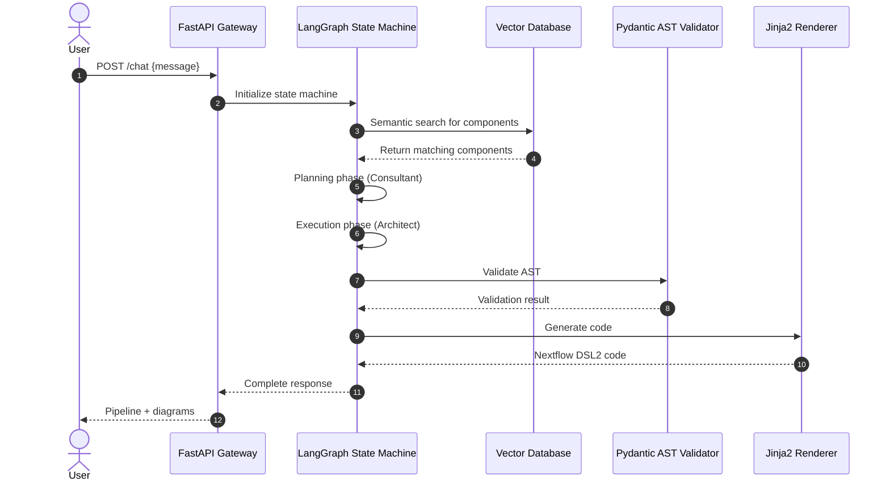
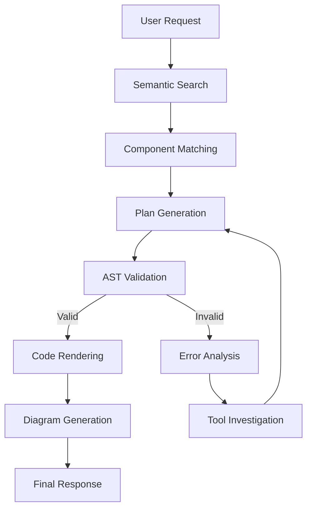

# Architecture Overview

## System Design

The izs-llm framework implements a sophisticated two-stage autonomous agent system for generating Nextflow DSL2 pipelines from natural language descriptions.

## Core Architecture

### Tri-State Event Horizon



### State Machine Components

#### 1. Consultant Subgraph (Planner)
- **Purpose**: Understand user intent and create execution plan
- **Key Nodes**:
  - `consultant_node`: Main planning LLM
  - `consultant_tools`: Component catalog lookup
  - `compact_memory_node`: Memory pruning
  - `consultant_extract_node`: Structured output extraction

#### 2. Architect Subgraph (Executor)
- **Purpose**: Generate valid Nextflow DSL2 code
- **Key Nodes**:
  - `hydrator_node`: Build technical context
  - `architect_precheck_node`: Channel math verification
  - `architect_generate_node`: AST generation
  - `architect_reason_node`: Reasoning with tools
  - `renderer_node`: Jinja2 templating
  - `deterministic_diagram_node`: AST-based visualization
  - `diagram_node`: LLM-based visualization

### Recent Architectural Changes

#### Diagrammer Refactoring (July 2026)
- **Before**: Iterative tool-calling loop with message accumulation
- **After**: One-shot prompting with fresh context each time
- **Impact**: 
  - Reduced context window usage
  - Eliminated message history complexity
  - Improved reliability and determinism
  - Simplified state management

#### Architect Node Enhancements
- **Mandatory Tool Calling**: Architect now requires tool usage for investigations
- **Internal Tagging**: Tool messages suppressed from API responses
- **Enhanced Metadata**: Component channels include usage examples
- **Improved Validation**: Better error handling and retry logic
- **Modularized Execution**: Dedicated iteration counter for tool execution
- **Enhanced Sanitization**: Improved message sanitization for LLM API compatibility

## Data Flow

### Knowledge Sources
1. **Component Catalog**: Nextflow component definitions
2. **Template Catalog**: Pipeline templates and patterns
3. **Vector DB**: Semantic embeddings for search
4. **AST Structure**: Pydantic validation schemas

### Processing Pipeline



## Key Innovations

### 1. Lossless Tool-Trajectory Compaction
- Extracts semantic facts from tool outputs
- Caches in structured `tool_memory` buffer
- Deletes raw tool call tokens from history
- Prevents context window exhaustion

### 2. Deterministic Approval Short-Circuiting
- Bypasses LLM for terminal routing decisions
- Uses heuristic detection for plan approval
- Forces direct transition to execution phase

### 3. Pydantic AST Enforcement
- LLM generates JSON AST, not raw code
- Deep Pydantic validation before rendering
- Channel math and variable verification
- Immutable source of truth

### 4. Dual Diagram Generation
- **Deterministic**: AST → Mermaid (exact representation)
- **Probabilistic**: Code → LLM → Mermaid (human-readable)
- Provides both precision and readability

## Technical Stack

### Core Technologies
- **FastAPI**: Web server and API layer
- **LangGraph**: State machine orchestration
- **Pydantic**: Validation and data modeling
- **Jinja2**: Code template rendering
- **ChromaDB/FAISS**: Vector search
- **OpenAI/Anthropic**: LLM providers

### Language Support
- **Primary**: Python 3.9+
- **Generated**: Nextflow DSL2
- **Configuration**: YAML/JSON

## Development Patterns

### Plugin Architecture
```
plugins/
└── <domain>/
    ├── catalog/
    │   ├── components.json
    │   ├── templates.json
    │   └── resources.json
    ├── code_store.jsonl
    ├── prompts/
    └── plugin.yaml
```

### Core vs Plugin Separation
- **Core**: Domain-agnostic logic engine
- **Plugins**: Domain-specific data and configurations
- **Benefit**: Swap domains without code changes

## Performance Considerations

### Memory Management
- Context window pruning via `compact_memory_node`
- Structured tool memory caching
- Selective state persistence

### Validation Overhead
- Pydantic AST validation before rendering
- Channel math verification
- Syntax checking at multiple stages

### LLM Optimization
- Structured output enforcement
- Tool usage constraints
- Prompt engineering for determinism

## Testing Strategy

### Evaluation Methods
- **Pairwise Glicko-2**: A/B comparison with position control
- **Pass@k**: Multiple generation attempts
- **Deterministic Validation**: Pydantic schema checking
- **Integration Tests**: End-to-end pipeline generation

### Test Coverage
- Component/tool interactions
- LangGraph state management
- Diagram generation
- API response handling

## Future Directions

### Planned Enhancements
- Expanded plugin ecosystem
- Additional LLM provider support
- Enhanced error recovery
- Performance optimization
- Extended evaluation metrics

### Research Areas
- Multi-modal input processing
- Advanced memory architectures
- Hybrid deterministic/probabilistic reasoning
- Adaptive prompt engineering

## Related Documentation

- [Quickstart Guide](/openwiki/quickstart.md)
- [Plugin System](/openwiki/plugins.md)
- [API Reference](/openwiki/api.md)
- [Testing Guide](/openwiki/testing.md)