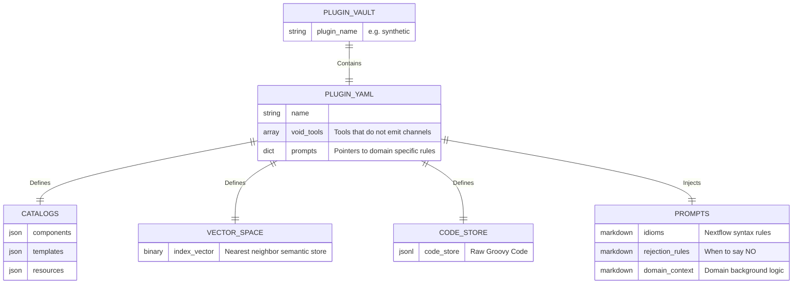
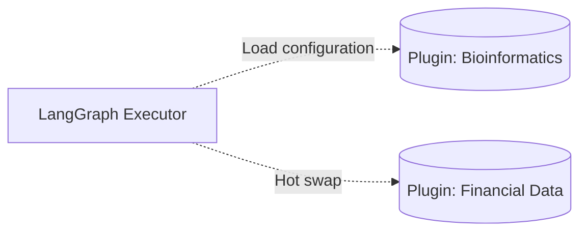

# `plugins/` - The Agentic Domain Registries

> [!CAUTION]
> This directory houses dynamically generated, isolated logic domains for the Nextflow AI Agent. Each plugin acts as an independent "brain module" for the AI, loaded dynamically.

## 1. Plugin Architecture

A plugin is not code; it is a mathematical and semantic definition of a specific domain. The LangGraph agent reads a plugin to learn what tools it possesses, how they connect, and what rules it must obey. This makes the core framework entirely tool-agnostic.

## 2. Folder Mechanics

### `synthetic/` (The Sandbox)
The default testing domain. It contains:
- `nf_source/`: Raw nextflow code used to test the ingestion pipeline (`task_a`, `process_b`, etc.).
- `chroma_index/` or `faiss_index/`: The pre-computed Qwen3 embedding vectors.
- `prompts/`: Domain rules. For example, `rejection_rules.md` explicitly teaches the AI when to refuse to build a pipeline based on domain impossibilities or logical constraints.

### `izs/` (Production Domain)
Reserved for the primary institute's private logic base. Structurally identical to the synthetic domain but populated with real-world, production-grade pipelines.

## 3. Why Use Plugins?

By abstracting pipelines into isolated plugins, the core `FastAPI` system is entirely tool-agnostic. To switch the AI from a "Bioinformatics Consultant" to a "Financial Data Architect", the API simply loads a different plugin configuration.

