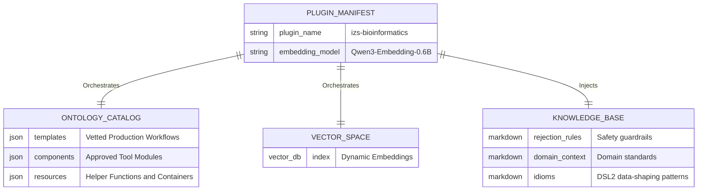

# `plugins/izs/` - Production Intelligence Domain

> [!IMPORTANT]
> This is the primary, production-grade domain plugin for the Institute. It defines the real-world domain catalog used by the domain-agnostic LangGraph agents. Modification of this directory fundamentally alters what the AI is capable of designing and generating.

## 1. Plugin Data Topography

## 2. Directory Structure

- **`plugin.yaml`**: The master configuration. Defines which vector index to load (e.g. `chroma_index` or `faiss_index`), the embedding model to use, static helper function imports, void tool detection rules, and RAG tuning parameters.
- **`prompts/`**: Contains the strict rules of engagement for this specific laboratory. `rejection_rules.md` explicitly tells the AI to reject invalid logic. `idioms.md` defines the critical data-shaping patterns (`extractKey`, `.cross()`, `.multiMap`) that the AI must follow.
- **`catalog/`**: The human-readable mapping of the lab's Nextflow tools (components, templates, resources).
- **`code_store.jsonl`**: The physical Nextflow code snippets — loaded at render time for reference code and usage examples.
- **`benchmark_data/`**: Tiered evaluation datasets (level 1–5) for testing AI code generation quality.
