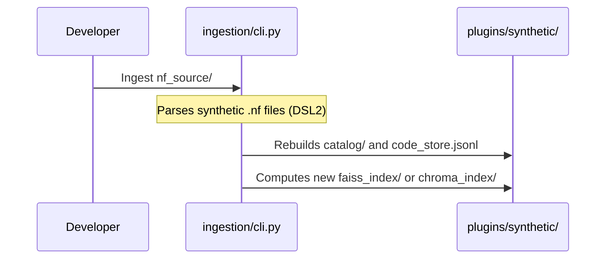

# `plugins/synthetic/` - Sandbox Domain

> [!TIP]
> This is a localized, non-destructive testing plugin. It mirrors the structural conventions of the production IZS plugin (DSL2 headers, `extractKey` cross patterns, triple-tuple references, void tool detection, helper function imports) using a small set of standard open-source genomics tools. This allows rapid testing of the LangGraph execution engines without exposing internal production logic.

## 1. Synthetic Subsystem Flow

## 2. Sub-Directories

- **`nf_source/`**: Raw `.nf` files mirroring production conventions. Includes `functions/common.nf` and `functions/parameters.nf` stubs that replicate the IZS helper function signatures (`extractKey`, `getSingleInput`, `getReference`, etc.).
- **`prompts/`**: Sandbox-level guardrails covering the same patterns as production: domain context, DSL2 idioms, and rejection rules.
- **`catalog/`**: Auto-generated by the ingestion pipeline. Contains `components.json`, `templates.json`, and `resources.json`.
- **`code_store.jsonl`**: Auto-generated JSONL with raw source code for each module/step.

## 3. Tools Available

| Tool | Category | Void? | Emit Channels |
|------|----------|-------|---------------|
| FastQC | QC | ✅ | — |
| Trimmomatic | Trimming | ❌ | `trimmed` |
| BWA-MEM2 | Mapping | ❌ | `aligned_bam`, `bam_index`, `coverage` |
| BCFtools | Variant Calling | ❌ | `variants` |
| SPAdes | Assembly | ❌ | `assembly` |
| Prokka | Annotation | ✅ | — |

## 4. Template Workflows

- **`module_illumina_variant_calling`**: QC → Trim → Align (with reference `.cross()`) → Variant call
- **`module_denovo_annotation`**: QC → Trim → Assemble → Annotate (void)
