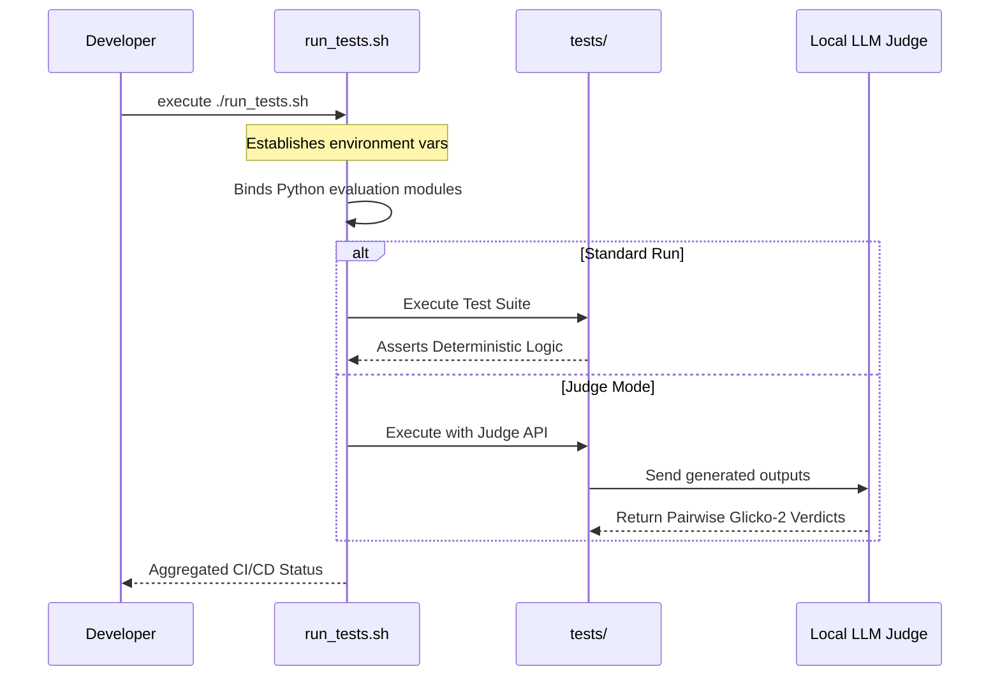

# `scripts/` - Autonomous DevOps Utilities

> [!TIP]
> This directory acts as the orchestration hub for CI/CD and localized system maintenance for the domain-agnostic agent. 

## 1. System Utility Matrix

The scripts herein manage everything outside the direct Python application layers.

## 2. Contained Assets

### `run_tests.sh`
The primary local testing script.
- Automates the test runner, injecting temporary environment overrides so tests don't corrupt the active Vector DB memory cache.
- Serves as the blueprint for `.github/workflows` when transitioning the repository to continuous integration.
