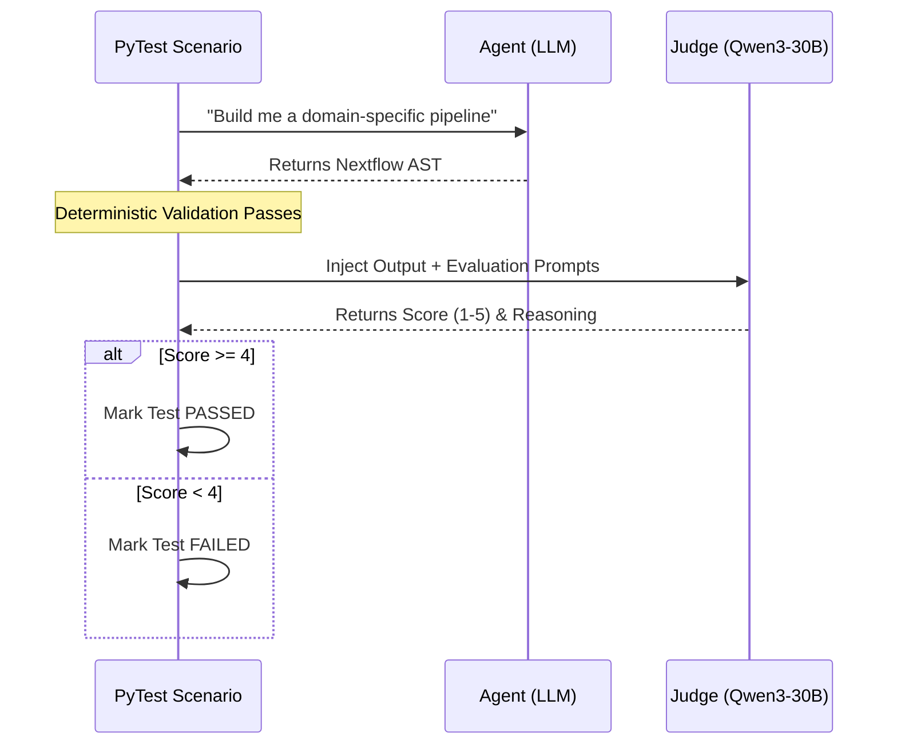

# `tests/evaluation/` - Automated LLM Judging Matrices

> [!CAUTION]
> **THIS DIRECTORY IS DEPRECATED.** 
> The Likert-scale LLM judge scoring has been replaced by the superior **Pairwise Glicko-2 Evaluation (Topo@k)** in the active `tests/` directory. This is kept solely for historical baseline comparisons.

## 1. LLM Judge Orchestration

Instead of relying purely on deterministic string-matching (which is brittle for generated code), the test suite invokes a secondary, heavily templated LLM at temperature 0.0 to evaluate the agent.

## 2. Component Files

### `schemas.py`
Defines the strict Pydantic models the Judge must adhere to when grading. Enforces that the Judge returns both `score` (integer) and `reasoning` (string) for metrics like `Faithfulness`, `Relevance`, `Syntax`, and `Mapping`.

### `prompts.py`
Contains the raw rubrics injected into the Judge.
- **The Consultant Judge**: Checks if the AI hallucinated tools that weren't in the Vector DB context space.
- **The Architect Judge**: Checks if the generated Nextflow DSL2 syntax accurately implements the agreed-upon design plan.
- **The Rejection Judge**: Specifically checks if the AI properly *refused* to build dangerous or domain-impossible requests (e.g., executing incompatible downstream logic).
