# `tests/scenarios/` - The AI Evaluation Matrix

> [!CAUTION]
> **THIS DIRECTORY IS DEPRECATED.** 
> This directory contains the exhaustive conversational state machines used to benchmark the V1 LangGraph agent. It simulates complex domain-specific requirements and measures the AI's success rate. It has been superseded by the active `tests/` directory.

## 1. The Difficulty Topology

The scenarios are layered to test different levels of cognitive load on the LLM.

```mermaid
gantt
    title Evaluation Scenario Hierarchy
    dateFormat X
    axisFormat %s

    section Level 1
    Simple Logic (Single Tool)       :a1, 0, 1
    section Level 2
    Template Matching                :a2, 1, 2
    section Level 3
    Complex Dynamic Routing          :a3, 2, 3
    section Level 4
    Guardrails (Domain Logic Refusals) :a4, 3, 4
    section Level 5
    Recreation Fidelity (Refactoring):a5, 4, 5
```

## 2. File Index

- **`level1_simple.py`**: Benchmarks basic RAG retrieval. (Can the AI find a single tool?)
- **`level2_medium.py`**: Benchmarks template alignment. (Can the AI use `EXACT_MATCH` to pull a standard workflow?)
- **`level3_complex.py`**: Stress-tests channel mathematics. (Can the AI branch outputs to multiple downstream processors?)
- **`level4_guardrails.py`**: Tests negative prompt adherence. (Will the AI refuse to build an impossible pipeline?)
- **`level5_recreation.py`**: Tests multi-turn revision. Simulates a human asking the AI to build a pipeline, and then asking it to swap out a core component in the next conversational turn.
